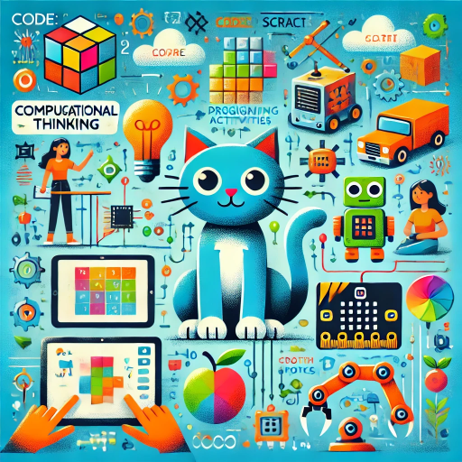

# Curso "Pensamiento computacional, diseñando actividades con programación y robótica

## Mayo 2025

## [https://bit.ly/PenCompu](https://bit.ly/PenCompu)

[QR](./images/bit.ly_PenCo.png)

 Licencia CC by  @javacasm 

### Introducción

El curso  "Pensamiento Computacional: Diseñando Actividades con Programación y Robótica", está orientado a estudiantes y docentes de educación primaria y secundaria. Se ha diseñado para introducir a los estudiantes en el pensamiento computacional y fomentar habilidades de resolución de problemas, creatividad y colaboración, utilizando plataformas accesibles como Code.org, Scratch, Makey-Makey y micro:bit

#### **Objetivos del Curso:**

1. Introducir los principios del pensamiento computacional y la programación.
2. Fomentar la creatividad y el trabajo colaborativo en la creación de proyectos.
3. Explorar el uso de herramientas tecnológicas como Code.org, Scratch, Makey-Makey y micro:bit para diseñar actividades educativas.
4. Desarrollar habilidades prácticas en robótica educativa para resolver problemas del mundo real.
5. Facilitar la aplicación de conceptos de programación y robótica en el aula.
### **Contenidos del Curso**

1. **Fundamentos de Pensamiento Computacional y Programación Básica**
   - Introducción al pensamiento computacional: descomposición, patrones, abstracción y algoritmos.
   - Programación visual con Code.org: ejercicios básicos de secuencias, bucles y condicionales.
   - Creación de proyectos iniciales en Code.org.

2. **Programación Creativa con Scratch**
   - Familiarización con la interfaz de Scratch y sus herramientas básicas.
   - Creación de historias animadas y juegos simples, usando eventos, bucles, variables y mensajes.
   - Proyectos colaborativos en Scratch para fomentar la creatividad y la interacción.

3. **Robótica y Electrónica Básica con Makey-Makey y micro:bit**
   - Introducción a Makey-Makey: construcción de circuitos interactivos y proyectos iniciales (ej. piano interactivo).
   - Integración de Makey-Makey y Scratch para controlar personajes y juegos.
   - Programación con micro:bit en MakeCode: uso de la pantalla LED, sensores y botones.
   - Creación de proyectos de medición y control, como sensores de temperatura o luz.

4. **Diseño de Actividades Educativas con Programación y Robótica**
   - Desarrollo de actividades interactivas para reforzar conceptos de matemáticas, ciencias y arte.
   - Creación de proyectos didácticos con Makey-Makey y micro:bit para diversas asignaturas.
   - Documentación y presentación de proyectos educativos; retroalimentación y evaluación.

Este curso combina habilidades técnicas y pedagógicas, aplicando el pensamiento computacional a través de herramientas accesibles y actividades creativas que pueden integrarse en distintas áreas de aprendizaje.

## Temario

1. [Programación en la educación](./scratch/1.0.ProgramacionEnEducacion.md)
2. [El pensamiento computacional y los juegos](./scratch/9.0.PC_Unplugged.md)
3. [Programando con bloques: Scratch](./scratch/3.0.Scratch3.0.md)
4. [Robótica en educación](./scratch/8.1.0.RoboticaEducacion.md)
5. [Robótica con micro:bit](./microbit/0.Introduccion.md)
## Herramientas

[Pensamiento computacional desconectado](https://csunplugged.org/es/)

[code.org](https://code.org)

[Scratch](https://scratch.mit.edu/)

[micro:bit](http://microbit.org/)

### Recursos

[Propuesta con objetivos mínimos para cada nivel educativo de Intef](http://code.intef.es/wp-content/uploads/2018/10/Ponencia-sobre-Pensamiento-Computacional.-Informe-Final.pdf#page=65)
