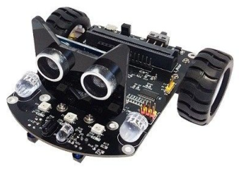
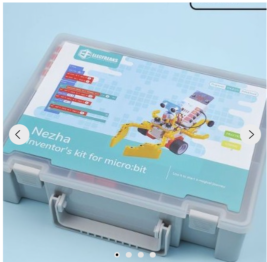
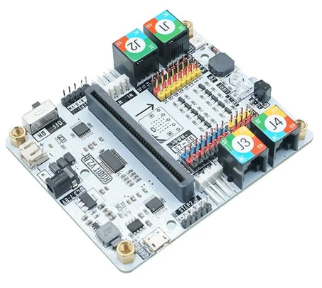
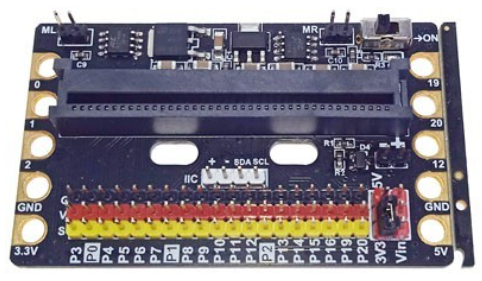

# Robots con micro:bit

[Catbot](https://www.micro-log.com/microbit/3283-coche-microbit.html)

[Nezha](https://www.micro-log.com/microbit/3640-nezha-inventor-s-kit-for-microbit.html)

[mBot con micro:bit](https://www.micro-log.com/microbit/3371-shield-robit-v20.html)

[placa extensor](https://www.micro-log.com/microbit/3725-zocalo-para-microbit-con-controlador-de-motores.html)

