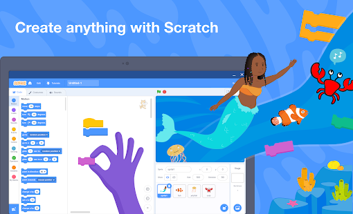

## Scratch en Tabletas (Android)

Para trabajar con tabletas tenemos varias opciones:

* Usar un navegador y la versión online de Scratch 3.0: Funciona bastante bien y yo diría que es 100% compatible
* [Aplicación Scratch](https://play.google.com/store/apps/details?id=org.scratch&hl=es_419) que nos permite trabajar offline y en la que podemos importar ficheros que hayamos descargado desde un ordenador. Podemos importarlos directamente o a través de Google Drive por ejemplo. Se supone que se puede exportar y compartir online (como en la web) pero en mi caso me ha dado problemas y no he podido hacerlo.

	

* [Scratch Jr](https://play.google.com/store/apps/details?id=org.scratchjr.android&hl=es_419) es una versión adaptada para los más pequeños, con menos bloques pero con casi toda la funcionalidad de la otra versión. Los bloques se colocan en líneas para simplificar.

	

[Vídeo: Scratch y Scratch Jr, aplicaciones para tabletas Android](https://youtu.be/AA2-o5FBH-A)
