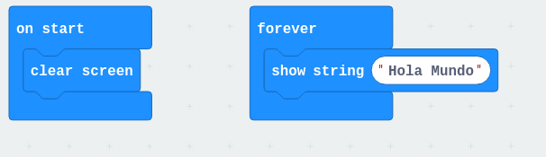
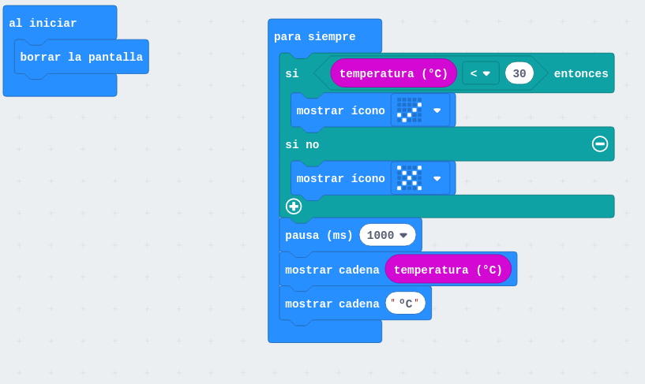
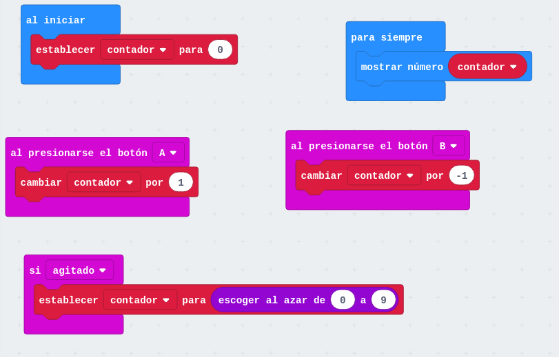
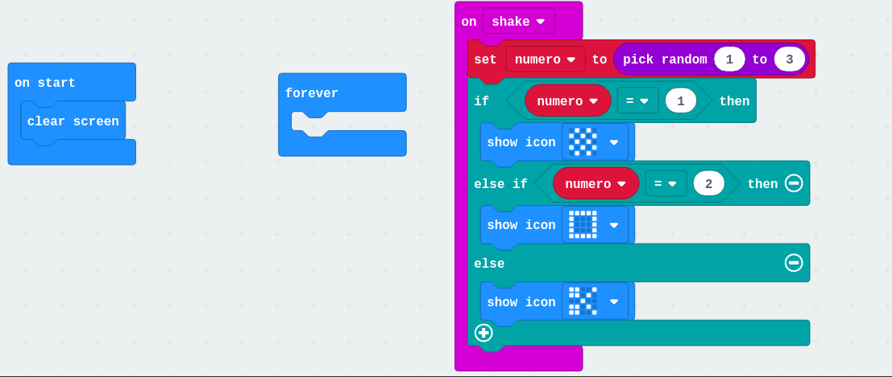

# BBC-microbit

[Fundación microbit](http://microbit.org/es/)

[Microbit es totalmente opensource](https://www.microbit.co.uk/open_source)

[Github de microbit](https://github.com/bbcmicrobit)

### [Hardware](http://microbit.org/es/hardware/)

#### Alimentación

Funciona a 3V y dispone de un conector de bateria y de alimentación por USB (MicroUSB)

#### Micro
ARM M0 (32 bits) a 16MHz con 16k de RAM
#### [Sensores](https://microbit.org/guide/features/)

* Acelerómetro
* Brújula
* 2 Botones
* 3 entradas analógicas (0,1,2)
* 20 pines I/O

#### Comunicaciones

[Bluetooth](http://microbit.org/es/mobile/) de bajo consumo

Comunicaciones via radio entre distintas microbits

[App microbit](https://play.google.com/store/apps/details?id=com.samsung.microbit&hl=es) Nos permite interaccionar con la placa e incluso programarla

#### Leds

25 (5x5) leds programables individualmente

### Documentación

[Getting started](http://microbit.org/es/start/)
## Programación con bloques https://makecode.microbit.org/

El simulador es interactivo y cambia la imagen del simulador a medida que usamos diferentes bloques

Los programas se guardan por defecto en nuestro navegador

Seleccionamos el idioma

La pantalla: 
* A la izquierda, Podemos simular nuestro programa
* Centor las paletas de bloques
* Bloques de mi programa

Añadir nuestros bloques en onStart (para que se ejecute al principio) o forever (para que se ejecute repetitivamente)

EJEMPLO [HOLA MUNDO](https://makecode.microbit.org/_MfyHdrLXVWqL)

Podemos cambiar el nombre
 
Una vez que tenemos un programa vamos a reprogramar la Microbit

1. Conectamos el microbit
1. Aparece una unidad llamada Microbit
1. Descargamos el programa
1. Lo copiamos a la unidad Microbit (veremos como parpadea el led naranja)
(En un tablet o móvil necesitaremos un cable OTG)

Usamos el sensor de temperatura (que está en la CPU con lo que no es muy preciso)

EJEMPLO de temperatura
1. Mostrar temperatura
1. Mostrar la temperatura en forma de barra

[Control de temperatura](https://makecode.microbit.org/_LesCE2h70PAT)

EJEMPLO: Control de iluminación digital y analógico

[Control de iluminación](https://makecode.microbit.org/_YqD3MePtK6gU)

[Control de iluminación II](https://makecode.microbit.org/_7ayKTtKvXFcc)

[ControlIluminacion III](https://makecode.microbit.org/_TVJAFy9mjJ3Y)

## Eventos

Pulsaciones de botones o cambios de pines, agitado

EJEMPLO: [¿a quién le toca?](https://makecode.microbit.org/_f9EhoRAp1eoR)
* boton A incrementa
* B decrementa 
* agitado pone número aleatorio

## Juegos

Hay una paleta de juegos que incluyen sprites, puntuaciones, etc

Los leds se direccionan así
(0,0) ..... (4,0)
...          ...
(0,4) ..... (4,4)

EJEMPLO: marcianitos simples

EJEMPLO: [piedra, papel o tijera](https://makecode.microbit.org/_0Xi5xA7gweK5)

EJEMPLO: dado digital

### Extensiones

Permiten usar extensiones que añaden más bloques 

PROYECTO termostato: los botones fijan la temperatura objetivo y la otra barra nos muestra la temperatura actual

PROYECTO maquinilla de numeros (innalámbrica)

# TODO

¿Recuperar programas de otro navegador?
Trabajar con la comunicacion serie
    
